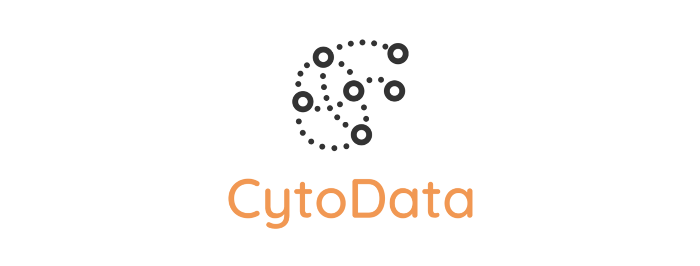

# Awesome Cytodata 

> A curated list of awesome cytodata resources.

[Cytodata](https://cytodata.org/) refers to a community of researchers and resources involved in the **image-based profiling** of **biological phenotypes**.
These **biological phenotypes** are typically induced by genetic or chemical perturbations and often represent disease states.
**Image-based profiling** is used to inspect these phenotypes to uncover biological insight including discovering the impact of genetic alterations and determining the mechanism of action of compounds.

This page represents a curated list of software, datasets, landmark publications, and image-based profiling methods.
Our goal is to provide researchers, both new and established, a place to discover and document awesome Cytodata resources.

## Contents

- [Software](#software)
- [Datasets](#datasets)
- [Publications](#publications)
  - [Review](#review)
  - [Applications](#applications)
  - [Methods](#methods)

## Software

Open source software packages for image-based profiling of biological phenotypes.

- [Advanced Cell Classifier](https://www.cellclassifier.org/) - A software package for exploration, annotation and classification of cells within large datasets using machine learning.
- [CellProfiler](http://cellprofiler.org/) - CellProfiler is a free open-source software for measuring and analyzing cell images.
- [CellProfiler Analyst](http://cellprofiler.org/cp-analyst/) - Interactive data exploration, analysis, and classification of large biological image sets.
- [Cytominer](https://github.com/cytomining/cytominer) - Methods for image-based cell profiling.
- [EBImage](https://github.com/aoles/EBImage) - Image processing toolbox for R.
- [HTSvis](http://htsvis.dkfz.de/HTSvis/) - A web app for exploratory data analysis and visualization of arrayed high-throughput screens.

## Datasets

Annotated datasets for image-based profiling.

- [Broad Bioimage Benchmark Collection](https://data.broadinstitute.org/bbbc/) - The Broad Bioimage Benchmark Collection (BBBC) is a collection of freely downloadable microscopy image sets. In addition to the images themselves, each set includes a description of the biological application and some type of "ground truth" (expected results).
- [Image Data Resource](https://idr.openmicroscopy.org/) - Public repository of image datasets from published scientific studies.
- [RxRx1](https://www.rxrx.ai) - RxRx1 is a set of 125,514 high-resolution 512x512 6-channel fluorescence microscopy images of human cells under 1,108 genetic perturbations in 51 experimental batches across four cell types.  The images were produced by Recursion Pharmaceuticals in their labs in Salt Lake City, Utah.  Researchers will use this dataset for studying and benchmarking methods for dealing with biological batch effects, as well as areas in machine learning such as domain adaptation, transfer learning, and k-shot learning.

## Publications

Publications related to image-based profiling.

### Review

- [Data-analysis strategies for image-based cell profiling](https://doi.org/10.1038/nmeth.4397) - Introduce the steps required to create high-quality image-based (i.e., morphological) profiles from a collection of microscopy images.
- [High-content screening for quantitative cell biology](https://doi.org/10.1016/j.tcb.2016.03.008) - Describe some recent applications of HCS, ranging from the identification of genes required for specific biological processes to the characterization of genetic interactions.
- [Microscopy-based high-content screening](https://doi.org/10.1016/j.cell.2015.11.007) - Describe the state of the art for image-based screening experiments and delineate experimental approaches and image-analysis approaches as well as discussing challenges and future directions, including leveraging CRISPR/Cas9-mediated genome engineering.

### Applications

- [Image-based multivariate profiling of drug responses from single cells](https://doi.org/10.1038/nmeth1032) - A multivariate method for classifying untreated and treated human cancer cells based on ∼300 single-cell phenotypic measurements.
- [Discovering metabolic disease gene interactions by correlated effects on cellular morphology](https://doi.org/10.1016/j.molmet.2019.03.001) - Profiling disease-gene interaction during adipocyte differentiation.
- [Phenotypic profiling of the human genome by time-lapse microscopy reveals cell division genes](https://doi.org/10.1038/nature08869) - This study provides an in-depth analysis of cell division phenotypes and makes the entire high-content data set available as a resource to the community.

### Methods

- [Cell Painting, a high-content image-based assay for morphological profiling using multiplexed fluorescent dyes](https://doi.org/10.1038/nprot.2016.105) - Protocol describing the design and execution of experiments using Cell Painting.
- [Multiplex Cytological Profiling Assay to Measure Diverse Cellular States](https://doi.org/10.1371/journal.pone.0080999) - Cell Painting assay.
- [CIDRE: an illumination-correction method for optical microscopy](https://doi.org/10.1038/nmeth.3323) - Retrospective method for illumination-correction based on energy minimization.
- [Retrospective shading correction based entropy minimization](https://doi.org/10.1046/j.1365-2818.2000.00669.x) - Method for retrospective shading correction based on entropy minimization.
- [Capturing single-cell heterogeneity via data fusion improves image-based profiling](https://doi.org/10.1038/s41467-019-10154-8) - Adds dispersion and covariances to population averages to capture single-cell heterogeneity.
- [Minimum redundancy feature selection from microarray gene expression data](https://doi.org/10.1142/S0219720005001004) - Minimum redundancy - maximum relevance feature selection framework.
- [Learning unsupervised feature representations for single cell microscopy images with paired cell painting](https://doi.org/10.1101/395954) - Selfsupervised method to learn feature representations of single cells in microscopy images without labelled training data.
- [Weakly supervised learning of single-cell feature embeddings](https://doi.org/10.1109/CVPR.2018.00970) - Training CNNs using a weakly supervised approach for feature learning.

## Contribute

Contributions welcome! Read the [contribution guidelines](contributing.md) first.

## License

